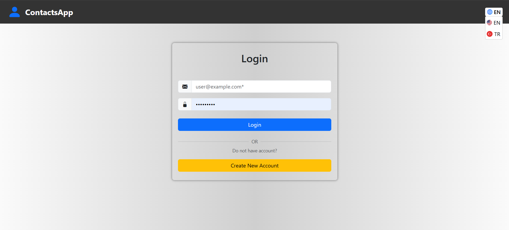
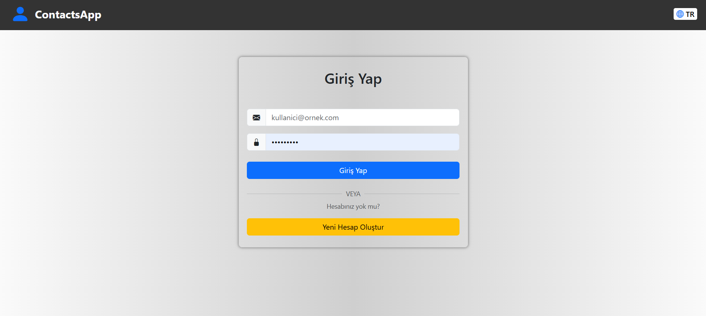
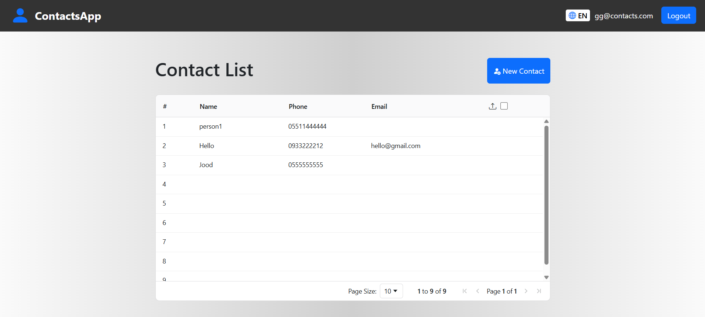
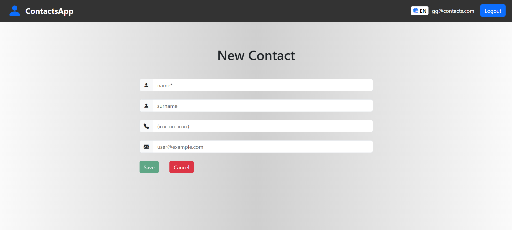
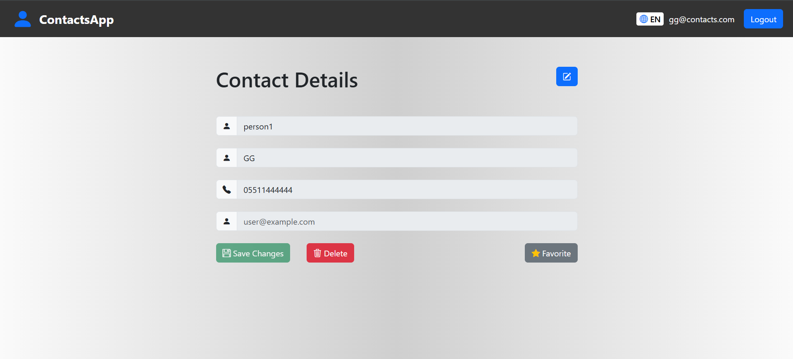

# ContactsApp

This project was generated with [Angular CLI](https://github.com/angular/angular-cli) version 18.1.4.

**For Backend Source Code : https://github.com/Esam-HM/ContactsApp.API**
---
## Description
A full-stack contact management application that allows users to create, view, update, and delete contacts efficiently.
This project is built to practice real-world full-stack development using modern technologies.

---

## Features
* Add new contacts
* View all saved contacts
* Edit existing contacts
* Delete contacts
* Responsive and user-friendly UI
* Multi language support

---

## Techologies Used
* **Frontend:** AngularJs, Bootstrap
* **Backend:** .NET Core v8
* **Database:** MsSQL, EF Core
* **API:** RESTful API
* **Design Patterns:** N-tier architecture, Repository Design Pattern
* **Tools:** VS, VS Code, Git, npm

---

## Screenshots

  
  

  
  
  

---

## Development server

Run `ng serve` for a dev server. Navigate to `http://localhost:4200/`. The application will automatically reload if you change any of the source files.

## Code scaffolding

Run `ng generate component component-name` to generate a new component. You can also use `ng generate directive|pipe|service|class|guard|interface|enum|module`.

## Build

Run `ng build` to build the project. The build artifacts will be stored in the `dist/` directory.

## Running unit tests

Run `ng test` to execute the unit tests via [Karma](https://karma-runner.github.io).

## Running end-to-end tests

Run `ng e2e` to execute the end-to-end tests via a platform of your choice. To use this command, you need to first add a package that implements end-to-end testing capabilities.

## Further help

To get more help on the Angular CLI use `ng help` or go check out the [Angular CLI Overview and Command Reference](https://angular.dev/tools/cli) page.
